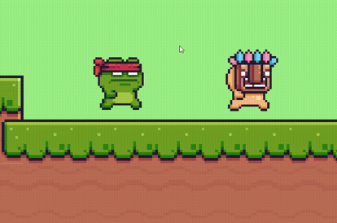
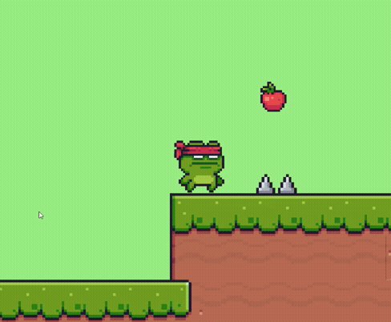
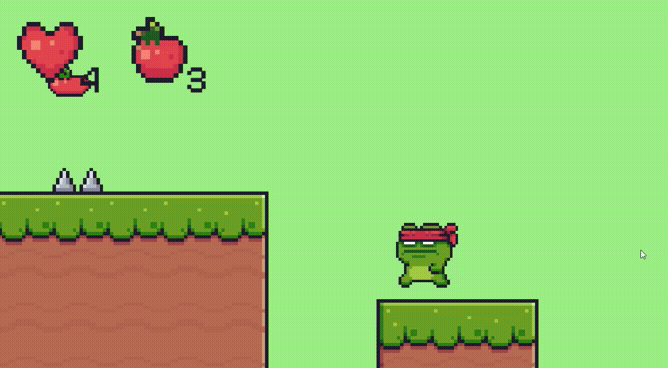
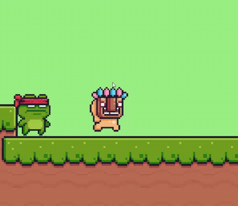
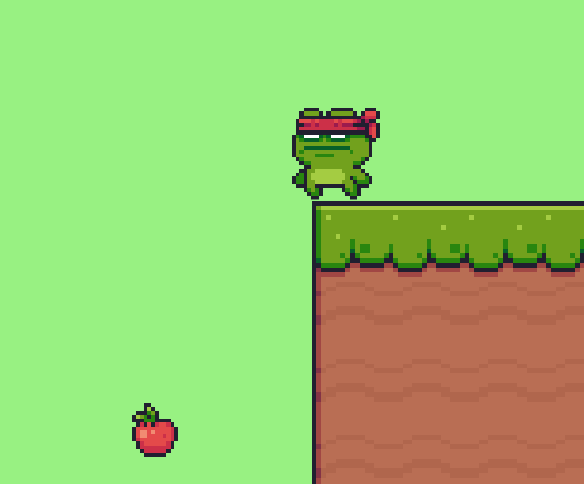
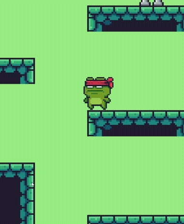

# Реализация простого платформера

Данный проект является тестовым заданием.

## Задание

Реализовать простые механики платформера:

- Спавн валюты (яблоки), простые idle анимации и помещение её в счётчик игрока.
- Врагов, которые будут патрулировать местность и наносить урон игроку.
- Получение игроком урона, а также нанесение урона врагам путем прыжка на голову врагов.
- Система смена уровней (в игре 2 уровня)
- Простые ловушки при поадании в которые игрок умирает.
- Анимации для врагов и игрока.

Цель каждого уровня:
- Найти и победить всех врагов на уровне.

---

[Скачать билд с Google Drive](https://drive.google.com/drive/folders/144kkDLfMqIjxFpWKr5Qs-1tT2EjLNko_?usp=sharing)

---

## На что следует обратить внимание в игре:

Получение урона игроком от врагов, когда тот касается не их головы (Получаем урон только пока разбирмаемся с управлением): 

  

Смерть игрока от ловушеки (Нужно быть аккуратнее):

  

Сбор валюты игроком (А зачем?):

  

Время мести (Избиение врага):

  

Прыжок веры (Рискнули бы?):

  

Менее интрегующий вылет с карты с последующей смертью:

  

### Используемые технологии

  
  
  
  
  
  
  
  
  

